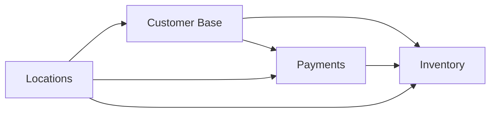

# MyComputer Documentation Hub

## 🏢 About MyComputer

MyComputer is a leading computer repair company operating across Europe, providing professional repair services, maintenance contracts, and technical support for both consumers and businesses. Our enterprise-grade infrastructure supports thousands of daily transactions across multiple countries, ensuring reliable and efficient service delivery.

## 📚 Documentation Overview

This documentation repository follows the **[Diataxis](https://diataxis.fr)** methodology, organizing content into four distinct categories to serve different user needs:

### Documentation Structure

```
mycomputer-docs/
├── common/                 # Shared documentation across all applications
│   ├── tutorials/         # Learning-oriented guides
│   ├── how-to/           # Task-oriented guides
│   ├── reference/        # Information-oriented docs
│   └── explanation/      # Understanding-oriented docs
│
├── inventory/            # Inventory Management Service
├── customer-base/        # Customer Relationship Management
├── payments/            # Payment Processing Service
└── locations/           # Locations Database Service
```

## 🚀 Applications

### 1. [Inventory Management](./inventory/README.md)
Comprehensive inventory tracking system for computer parts and components used in repairs.
- Real-time stock management
- Multi-warehouse support
- Automated reordering
- Parts compatibility tracking

### 2. [Customer Base (CRM)](./customer-base/README.md)
Full-featured customer relationship management solution with frontend and backend.
- Customer profiles and history
- Service ticket management
- Communication tracking
- Analytics and reporting

### 3. [Payments Processing](./payments/README.md)
Secure payment processing integrated with Stripe for all financial transactions.
- Multi-currency support
- Subscription management
- Automated invoicing
- PCI DSS compliant

### 4. [Locations Service](./locations/README.md)
Comprehensive database of all MyComputer locations across Europe.
- GeoJSON support for mapping
- Store information management
- Service area coverage
- Real-time availability

## 🏗️ Technology Stack

### Infrastructure
- **Cloud Provider**: Amazon Web Services (AWS)
- **Deployment**: Multi-AZ with high availability
- **Container Orchestration**: AWS ECS with Fargate
- **Load Balancing**: Application Load Balancer (ALB)
- **CDN**: CloudFront

### Application Stack
- **Runtime**: Node.js 18 LTS
- **Framework**: Next.js 14
- **API**: RESTful with OpenAPI specification
- **Database**: PostgreSQL 15
- **Cache**: Redis (ElastiCache)
- **Message Queue**: Amazon SQS

### Security & Compliance
- **Authentication**: JWT with OAuth 2.0
- **Encryption**: TLS 1.3, AES-256
- **Compliance**: GDPR, PCI DSS Level 1
- **Monitoring**: CloudWatch, X-Ray
- **Secrets Management**: AWS Secrets Manager

## 📖 Documentation Categories

### 📚 Tutorials
Step-by-step guides for getting started with our systems:
- [Getting Started Guide](./common/tutorials/getting-started.md)
- [AWS Deployment Tutorial](./common/tutorials/aws-deployment.md)
- Service-specific onboarding guides

### 🔧 How-To Guides
Practical guides for accomplishing specific tasks:
- [Setup Monitoring](./common/how-to/setup-monitoring.md)
- [Configure Auto-Scaling](./common/how-to/configure-scaling.md)
- [Disaster Recovery Procedures](./common/how-to/disaster-recovery.md)

### 📖 Reference
Technical specifications and API documentation:
- [AWS Infrastructure Reference](./common/reference/aws-infrastructure.md)
- API documentation for each service
- Data models and schemas
- Configuration options

### 💡 Explanations
Conceptual documentation for understanding the system:
- [Architecture Overview](./common/explanation/architecture-overview.md)
- Business use cases
- Design decisions
- Best practices

## 🚦 Getting Started

### Prerequisites
- AWS Account with appropriate permissions
- Node.js 18+ and npm 9+
- Docker Desktop (for local development)
- Git and basic command line knowledge

### Quick Start

1. **Clone the Repository**
   ```bash
   git clone https://github.com/mycomputer/documentation.git
   cd mycomputer-docs
   ```

2. **Choose Your Path**
   - **Developers**: Start with [Getting Started Guide](./common/tutorials/getting-started.md)
   - **DevOps**: Review [AWS Infrastructure](./common/reference/aws-infrastructure.md)
   - **Business Users**: Explore application-specific READMEs
   - **Support Staff**: Check How-To guides for common tasks

3. **Access Application Documentation**
   - Navigate to the specific application folder
   - Review the README for application overview
   - Explore relevant documentation categories

## 🔗 Integration Points

Our applications are designed to work seamlessly together:



- **Customer Base ↔ Payments**: Customer billing and payment history
- **Inventory ↔ Payments**: Parts pricing and cost tracking
- **Locations ↔ All Services**: Regional operations and tax calculations
- **All Services**: Shared authentication and authorization

## 📊 Key Metrics

### System Performance
- **Availability**: 99.99% uptime SLA
- **Response Time**: 200ms p95 latency
- **Throughput**: 10,000+ concurrent users
- **Data Durability**: 99.999999999% (11 9's)

### Business Impact
- **Locations**: 200+ stores across Europe
- **Transactions**: 50,000+ daily repairs
- **Customers**: 2M+ active customers
- **Inventory Items**: 100,000+ SKUs

## 🛠️ Development

### Local Development Setup
Each application can be run locally for development:

```bash
# Navigate to application directory
cd [application-name]

# Install dependencies
npm install

# Configure environment
cp .env.example .env
# Edit .env with your configuration

# Run development server
npm run dev
```

### Testing
```bash
# Unit tests
npm test

# Integration tests
npm run test:integration

# End-to-end tests
npm run test:e2e
```

### Deployment
All applications use CI/CD pipelines:
- **Development**: Automatic deployment on merge to `develop`
- **Staging**: Automatic deployment on merge to `staging`
- **Production**: Manual approval required for `main` branch

## 📝 Contributing

### Documentation Standards
- Follow Diataxis methodology for content organization
- Use clear, concise language
- Include code examples where relevant
- Keep documentation up-to-date with code changes

### Style Guide
- Use British English spelling
- Follow Markdown best practices
- Include diagrams for complex concepts
- Provide real-world examples

### Review Process
1. Create feature branch from `develop`
2. Make documentation changes
3. Submit pull request with clear description
4. Await review from documentation team
5. Address feedback and merge

## 🆘 Support

### Internal Resources
- **Slack Channels**:
  - `#tech-documentation` - Documentation questions
  - `#platform-support` - Technical support
  - `#devops` - Infrastructure issues
  
### Escalation Path
1. Check relevant documentation
2. Search existing issues/tickets
3. Contact team lead
4. Create JIRA ticket if unresolved

### Emergency Contacts
- **On-Call Engineer**: Via PagerDuty
- **Platform Team Lead**: platform-lead@mycomputer.eu
- **Documentation Team**: docs-team@mycomputer.eu

## 📜 License

Copyright © 2024 MyComputer. All rights reserved.

This documentation is proprietary and confidential. Internal use only.

## 🔄 Version History

| Version | Date | Description |
|---------|------|-------------|
| 2.0.0 | 2024-01 | Migration to Diataxis methodology |
| 1.5.0 | 2023-09 | Added Payments service documentation |
| 1.0.0 | 2023-01 | Initial documentation release |

## 🎯 Roadmap

### Q1 2024
- [ ] GraphQL API documentation
- [ ] Video tutorials for common tasks
- [ ] Interactive API playground

### Q2 2024
- [ ] Multi-language documentation support
- [ ] Advanced search capabilities
- [ ] Documentation versioning system

### Q3 2024
- [ ] AI-powered documentation assistant
- [ ] Automated documentation generation
- [ ] Performance optimization guides

---

**Last Updated**: January 2024  
**Maintained By**: MyComputer Documentation Team  
**Review Cycle**: Monthly
