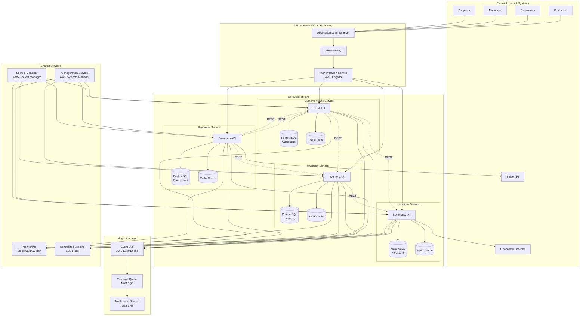
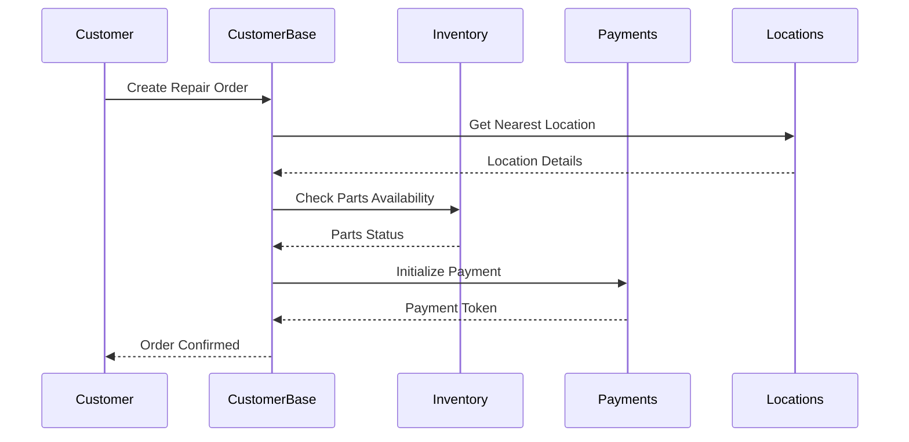
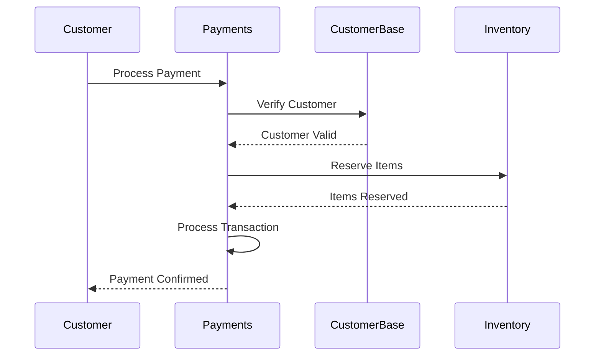
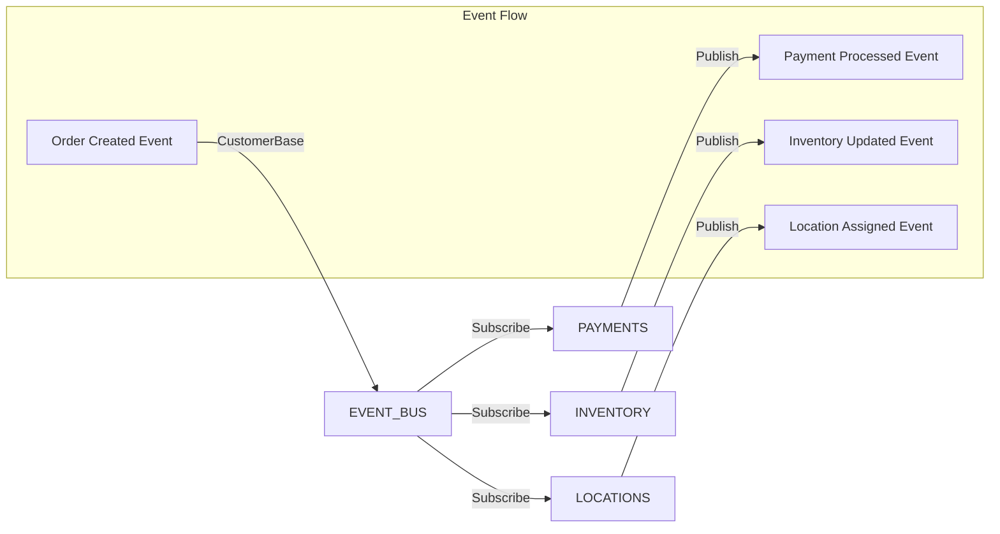
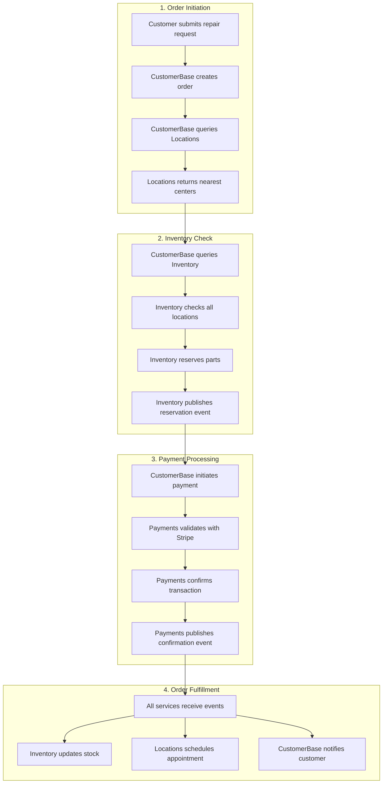
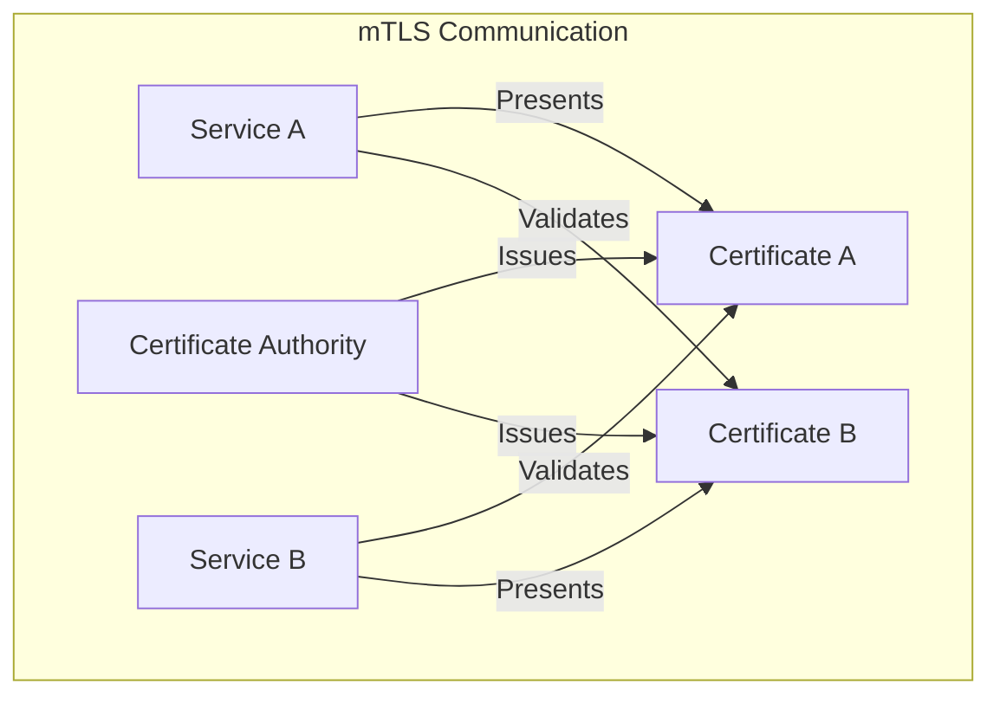
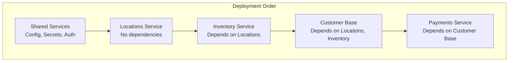
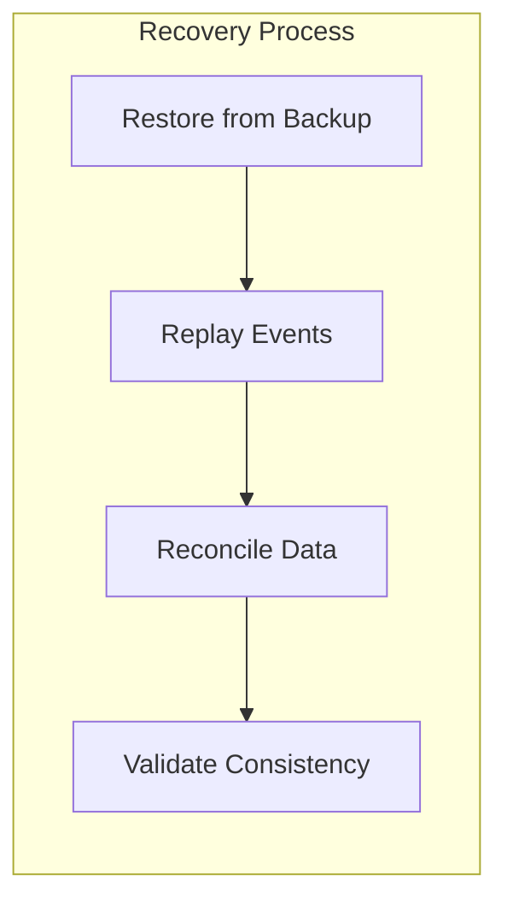

# System Interconnections Architecture

## Overview

This document provides a comprehensive view of how MyComputer's four core applications interconnect and communicate with each other. The system follows a microservices architecture with both synchronous and asynchronous communication patterns.

## System-Wide Interconnection Diagram



## Communication Patterns

### 1. Synchronous Communication (REST APIs)

#### Customer Base → Other Services


#### Payments → Other Services


### 2. Asynchronous Communication (Event-Driven)

#### Order Processing Flow


## Integration Points

### Customer Base Service

| Integration | Type | Purpose | Frequency |
|------------|------|---------|-----------|
| → Inventory | REST | Check stock availability | High |
| → Payments | REST | Process customer payments | High |
| → Locations | REST | Find service locations | Medium |
| ← Inventory | Event | Stock level updates | Medium |
| ← Payments | Event | Payment confirmations | High |
| ← Locations | Event | Appointment updates | Medium |

### Inventory Service

| Integration | Type | Purpose | Frequency |
|------------|------|---------|-----------|
| ← Customer Base | REST | Stock queries | High |
| → Locations | REST | Check location inventory | Medium |
| ← Payments | REST | Reserve items for payment | High |
| → Customer Base | Event | Low stock alerts | Low |
| → Locations | Event | Inventory transfers | Medium |

### Payments Service

| Integration | Type | Purpose | Frequency |
|------------|------|---------|-----------|
| → Customer Base | REST | Customer verification | High |
| → Inventory | REST | Item reservation | High |
| → Stripe | REST | Payment processing | High |
| → Customer Base | Event | Payment status | High |
| → Inventory | Event | Payment confirmation | High |

### Locations Service

| Integration | Type | Purpose | Frequency |
|------------|------|---------|-----------|
| ← Customer Base | REST | Location queries | High |
| ← Inventory | REST | Local stock check | Medium |
| → Geocoding | REST | Address validation | Low |
| → Customer Base | Event | Capacity updates | Low |
| → Inventory | Event | Transfer requests | Low |

## Data Flow Scenarios

### Scenario 1: Customer Repair Order



### Scenario 2: Inventory Transfer Between Locations

```mermaid
graph LR
    subgraph "Transfer Initiation"
        T1[Location A: Low Stock Alert]
        T2[Inventory: Identify Surplus Location B]
        T3[Inventory: Create Transfer Order]
    end
    
    subgraph "Transfer Execution"
        T4[Locations: Calculate Route]
        T5[Inventory: Update Stock Levels]
        T6[CustomerBase: Notify Affected Orders]
    end
    
    subgraph "Transfer Completion"
        T7[Inventory: Confirm Receipt]
        T8[Locations: Update Availability]
        T9[All Services: Update Status]
    end
    
    T1 --> T2 --> T3
    T3 --> T4 --> T5 --> T6
    T6 --> T7 --> T8 --> T9
```



## API Dependencies Matrix

| Service | Depends On | Depended By | Critical Dependencies |
|---------|-----------|-------------|----------------------|
| Customer Base | Inventory, Payments, Locations | Payments | Payments (for orders) |
| Inventory | Locations | Customer Base, Payments | None (can operate independently) |
| Payments | Customer Base, Inventory, Stripe | Customer Base | Stripe (external) |
| Locations | Geocoding | Customer Base, Inventory | None (can operate independently) |

## Event Catalog

### Business Events

| Event | Publisher | Subscribers | Payload |
|-------|-----------|------------|---------|
| `order.created` | Customer Base | Inventory, Payments, Locations | Order details, customer ID |
| `payment.processed` | Payments | Customer Base, Inventory | Transaction ID, amount, status |
| `inventory.reserved` | Inventory | Payments, Customer Base | Items, quantities, location |
| `inventory.updated` | Inventory | Customer Base, Locations | Item ID, stock levels |
| `location.capacity.changed` | Locations | Customer Base, Inventory | Location ID, new capacity |
| `appointment.scheduled` | Locations | Customer Base | Appointment details |
| `customer.updated` | Customer Base | Payments | Customer ID, changed fields |
| `refund.initiated` | Payments | Customer Base, Inventory | Transaction ID, reason |

### System Events

| Event | Publisher | Subscribers | Purpose |
|-------|-----------|------------|---------|
| `service.health.check` | All Services | Monitoring | Health status reporting |
| `cache.invalidated` | Any Service | Cache Manager | Cache synchronization |
| `config.updated` | Config Service | All Services | Configuration changes |
| `alert.triggered` | Monitoring | Operations Team | System alerts |

## Resilience Patterns

### Circuit Breakers

Each service implements circuit breakers for external dependencies:

```yaml
Customer Base:
  - Inventory API: 5 failures in 60s opens circuit
  - Payments API: 3 failures in 30s opens circuit
  - Locations API: 5 failures in 60s opens circuit

Payments:
  - Stripe API: 3 failures in 30s opens circuit
  - Customer Base API: 5 failures in 60s opens circuit

Inventory:
  - Locations API: 5 failures in 60s opens circuit

Locations:
  - Geocoding API: 10 failures in 120s opens circuit
```

### Fallback Strategies

| Service | Dependency | Fallback Strategy |
|---------|-----------|------------------|
| Customer Base | Inventory | Show cached availability |
| Customer Base | Locations | Use default location |
| Payments | Stripe | Queue for retry |
| Locations | Geocoding | Use cached coordinates |
| Inventory | Locations | Assume all locations |

## Security Boundaries

### Service-to-Service Authentication



### API Gateway Security

- **Rate Limiting**: 1000 requests/minute per API key
- **Authentication**: JWT tokens with 1-hour expiry
- **Authorization**: Role-based access control (RBAC)
- **Encryption**: TLS 1.3 for all communications

## Performance Considerations

### Latency Requirements

| Communication Path | Max Latency | Current p99 |
|-------------------|-------------|-------------|
| Customer Base → Inventory | 200ms | 145ms |
| Customer Base → Payments | 500ms | 380ms |
| Customer Base → Locations | 150ms | 120ms |
| Payments → Stripe | 2000ms | 1500ms |
| Locations → Geocoding | 1000ms | 750ms |

### Throughput Capacity

| Service | Peak TPS | Sustained TPS | Auto-scale Trigger |
|---------|----------|---------------|-------------------|
| Customer Base | 5000 | 2000 | 70% CPU |
| Inventory | 3000 | 1500 | 70% CPU |
| Payments | 2000 | 1000 | 60% CPU |
| Locations | 4000 | 2000 | 70% CPU |

## Monitoring and Observability

### Distributed Tracing

All inter-service communications include:
- **Trace ID**: Unique identifier for the entire request chain
- **Span ID**: Identifier for individual service operations
- **Parent Span ID**: Links to calling service
- **Baggage**: Business context (customer ID, order ID)

### Key Metrics

| Metric | Target | Alert Threshold |
|--------|--------|-----------------|
| Inter-service latency | < 200ms p99 | > 500ms |
| Circuit breaker trips | < 1/hour | > 5/hour |
| Event processing lag | < 5 seconds | > 30 seconds |
| API error rate | < 0.1% | > 1% |

## Deployment Coordination

### Service Dependencies for Deployment



### Version Compatibility Matrix

| Service | Current Version | Compatible With |
|---------|----------------|-----------------|
| Customer Base | v2.3.0 | Inventory v2.x, Payments v3.x, Locations v1.x |
| Inventory | v2.1.0 | Customer Base v2.x, Locations v1.x |
| Payments | v3.0.1 | Customer Base v2.x, Inventory v2.x |
| Locations | v1.5.0 | All versions |

## Disaster Recovery

### Service Recovery Priority

1. **Priority 1**: Payments (Revenue critical)
2. **Priority 2**: Customer Base (Customer facing)
3. **Priority 3**: Inventory (Operations critical)
4. **Priority 4**: Locations (Support function)

### Data Synchronization Recovery



## Future Integration Plans

### Planned Integrations

1. **Analytics Service**: Real-time business intelligence
2. **ML Service**: Predictive maintenance and demand forecasting
3. **Mobile Backend**: Dedicated mobile API gateway
4. **Partner API**: B2B integration platform
5. **IoT Service**: Connected device management

### API Gateway Evolution

Moving towards:
- GraphQL federation for client queries
- gRPC for internal service communication
- WebSocket support for real-time updates
- API versioning strategy implementation

## Conclusion

The interconnected architecture of MyComputer's services provides:

- **Resilience**: Through circuit breakers and fallback strategies
- **Scalability**: Through independent service scaling
- **Flexibility**: Through loose coupling and event-driven patterns
- **Observability**: Through comprehensive monitoring and tracing
- **Security**: Through defense-in-depth and zero-trust principles

This architecture enables MyComputer to maintain high availability while supporting complex business workflows across all four core applications.
