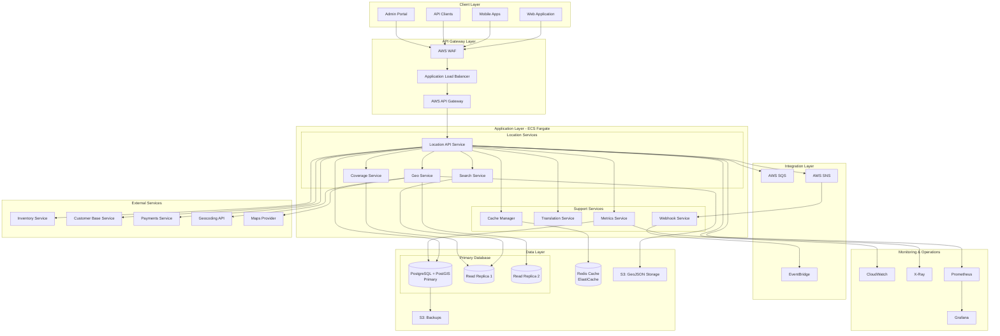
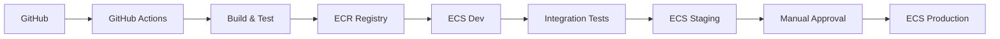

# Locations Service Architecture

## Overview

The Locations Service is built on a cloud-native, microservices architecture deployed on AWS. It leverages PostgreSQL with PostGIS for geospatial data management, providing high availability, scalability, and performance for location-based operations across Europe.

## Architecture Diagram



## Component Details

### 1. Client Layer

#### Web Application
- **Technology**: React/Next.js
- **Features**: Interactive maps, location search, service booking
- **Authentication**: JWT tokens via AWS Cognito
- **CDN**: CloudFront for static assets

#### Mobile Applications
- **Platforms**: iOS (Swift), Android (Kotlin)
- **Features**: GPS-based location, offline maps, push notifications
- **SDK**: Custom Locations SDK for consistent API access

#### Admin Portal
- **Technology**: React with Material-UI
- **Features**: Location management, metrics dashboard, configuration
- **Access Control**: Role-based permissions

### 2. API Gateway Layer

#### AWS WAF (Web Application Firewall)
- **DDoS Protection**: Rate limiting and IP blocking
- **Security Rules**: OWASP Top 10 protection
- **Geo-blocking**: Country-level access control
- **Custom Rules**: API key validation, request filtering

#### Application Load Balancer
- **Multi-AZ Deployment**: High availability across zones
- **Health Checks**: Automatic instance monitoring
- **SSL Termination**: TLS 1.3 support
- **Path-based Routing**: Service distribution

#### AWS API Gateway
- **REST API**: OpenAPI 3.0 specification
- **Rate Limiting**: Per-client throttling
- **Request Validation**: Schema validation
- **API Keys**: Client authentication and tracking

### 3. Application Layer (ECS Fargate)

#### Location API Service
```yaml
Service: location-api
Runtime: Node.js 20.x
Framework: Express.js / Fastify
Instances: 3-10 (auto-scaling)
CPU: 2 vCPU
Memory: 4 GB
Environment:
  - DATABASE_URL
  - REDIS_URL
  - AWS_REGION
  - SERVICE_DISCOVERY_NAMESPACE
```

#### Geo Service
```yaml
Service: geo-service
Purpose: Geospatial calculations and routing
Technology: Node.js with Turf.js
Features:
  - Distance calculations
  - Polygon operations
  - Route optimization
  - Geocoding/reverse geocoding
```

#### Search Service
```yaml
Service: search-service
Purpose: Fast location queries
Technology: Node.js with PostgreSQL FTS
Features:
  - Full-text search
  - Fuzzy matching
  - Multi-language support
  - Faceted search
```

#### Coverage Service
```yaml
Service: coverage-service
Purpose: Service area management
Technology: Node.js with PostGIS
Features:
  - Coverage polygon management
  - Point-in-polygon checks
  - Service availability calculation
  - Dynamic coverage updates
```

### 4. Data Layer

#### PostgreSQL with PostGIS
```sql
-- Configuration
Version: PostgreSQL 15
Extension: PostGIS 3.3
Instance: db.r6g.2xlarge
Storage: 1TB SSD (gp3)
IOPS: 16,000
Multi-AZ: Yes
Backup: Automated daily, 35-day retention

-- Performance Tuning
shared_buffers = 8GB
effective_cache_size = 24GB
work_mem = 128MB
maintenance_work_mem = 2GB
max_connections = 500
```

#### Redis Cache (ElastiCache)
```yaml
Engine: Redis 7.0
Node Type: cache.r6g.xlarge
Nodes: 3 (1 primary, 2 replicas)
Memory: 13.5 GB per node
Eviction Policy: allkeys-lru
Persistence: AOF enabled
Features:
  - Location data caching
  - Session management
  - Rate limiting counters
  - Geospatial indexes
```

#### S3 Storage
```yaml
Buckets:
  - mycomputer-locations-geojson
    - Purpose: GeoJSON file storage
    - Versioning: Enabled
    - Lifecycle: Archive after 90 days
  
  - mycomputer-locations-backups
    - Purpose: Database backups
    - Encryption: AES-256
    - Replication: Cross-region
```

### 5. Integration Layer

#### AWS SQS (Message Queue)
```yaml
Queues:
  - location-updates-queue
    - Type: Standard
    - Retention: 14 days
    - DLQ: Yes
  
  - location-metrics-queue
    - Type: FIFO
    - Deduplication: Content-based
```

#### AWS SNS (Notification Service)
```yaml
Topics:
  - location-events
    - Subscribers: Webhook service, Analytics
  - location-alerts
    - Subscribers: Operations team, Monitoring
```

#### EventBridge
```yaml
Event Bus: mycomputer-locations
Rules:
  - location-created
  - location-updated
  - location-deleted
  - coverage-changed
Targets: Lambda functions, SQS, external webhooks
```

### 6. Security Architecture

#### Network Security
```yaml
VPC Configuration:
  - CIDR: 10.0.0.0/16
  - Public Subnets: 10.0.1.0/24, 10.0.2.0/24
  - Private Subnets: 10.0.10.0/24, 10.0.11.0/24
  - Database Subnets: 10.0.20.0/24, 10.0.21.0/24

Security Groups:
  - ALB-SG: Ports 80, 443 from 0.0.0.0/0
  - ECS-SG: Port 3000 from ALB-SG
  - RDS-SG: Port 5432 from ECS-SG
  - Redis-SG: Port 6379 from ECS-SG
```

#### Data Security
- **Encryption at Rest**: AWS KMS for RDS, S3
- **Encryption in Transit**: TLS 1.3 for all connections
- **Secrets Management**: AWS Secrets Manager
- **Access Control**: IAM roles and policies

### 7. Deployment Architecture

#### CI/CD Pipeline


#### Infrastructure as Code
```yaml
Tool: Terraform
Version: 1.5.x
Modules:
  - networking
  - compute
  - database
  - storage
  - monitoring
State: S3 backend with DynamoDB locking
```

### 8. Monitoring & Observability

#### CloudWatch Metrics
```yaml
Custom Metrics:
  - API response times
  - Location search latency
  - Coverage calculation time
  - Cache hit ratio
  - Database connection pool

Alarms:
  - High API latency (> 500ms)
  - Low cache hit ratio (< 80%)
  - Database CPU (> 80%)
  - Error rate (> 1%)
```

#### X-Ray Tracing
```yaml
Segments:
  - API Gateway
  - Location Service
  - Database Queries
  - External API Calls
  - Cache Operations
```

#### Logging Strategy
```yaml
Log Groups:
  - /aws/ecs/location-api
  - /aws/rds/postgresql
  - /aws/elasticache/redis

Log Retention: 30 days
Log Insights: Custom queries for analysis
Export: S3 for long-term storage
```

## Scalability Patterns

### Horizontal Scaling
- **ECS Auto-scaling**: Based on CPU/memory metrics
- **Database Read Replicas**: Distribute read load
- **Cache Sharding**: Partition data across nodes
- **CDN Distribution**: Global edge locations

### Vertical Scaling
- **Database Instance Types**: Upgradeable without downtime
- **Cache Node Types**: Resizable based on demand
- **ECS Task Definitions**: Adjustable CPU/memory

## Disaster Recovery

### Backup Strategy
```yaml
RDS Backups:
  - Automated: Daily snapshots
  - Manual: Before major changes
  - Retention: 35 days
  - Cross-region: Replicated to eu-central-1

S3 Backups:
  - Versioning: All objects
  - Replication: Cross-region
  - Lifecycle: Archive to Glacier
```

### Recovery Procedures
```yaml
RTO (Recovery Time Objective): 1 hour
RPO (Recovery Point Objective): 15 minutes

Failover Process:
  1. Promote read replica to primary
  2. Update DNS records
  3. Redirect traffic to standby region
  4. Verify service health
  5. Notify stakeholders
```

## Performance Optimization

### Database Optimization
- **Spatial Indexes**: GIST indexes for geographic queries
- **Partitioning**: Time-based for metrics tables
- **Connection Pooling**: PgBouncer for connection management
- **Query Optimization**: Explain analyze for slow queries

### Caching Strategy
```yaml
Cache Levels:
  1. CDN: Static assets, API responses
  2. Application: In-memory caching
  3. Redis: Shared cache across instances
  4. Database: Query result caching

Cache Invalidation:
  - TTL-based: 5 minutes for dynamic data
  - Event-based: On data updates
  - Manual: Admin-triggered refresh
```

### API Optimization
- **Response Compression**: Gzip/Brotli
- **Pagination**: Limit result sets
- **Field Selection**: GraphQL-like queries
- **Batch Operations**: Reduce round trips

## Cost Optimization

### Resource Management
```yaml
Cost Savings:
  - Spot Instances: 70% discount for batch jobs
  - Reserved Instances: 40% discount for RDS
  - S3 Intelligent Tiering: Automatic cost optimization
  - Auto-scaling: Pay only for used capacity
```

### Monitoring Costs
```yaml
AWS Cost Explorer:
  - Service-level breakdown
  - Tag-based cost allocation
  - Budget alerts
  - Recommendation engine
```

## Future Architecture Enhancements

### Planned Improvements
1. **GraphQL API**: Flexible data fetching
2. **Event Sourcing**: Complete audit trail
3. **CQRS Pattern**: Separate read/write models
4. **Service Mesh**: Istio for service communication
5. **Serverless Functions**: Lambda for event processing
6. **ML Integration**: SageMaker for predictions
7. **Real-time Updates**: WebSocket connections
8. **Multi-region Active-Active**: Global distribution

## Conclusion

The Locations Service architecture provides a robust, scalable, and secure foundation for MyComputer's location management needs. Built on AWS cloud services with modern architectural patterns, it ensures high availability, performance, and flexibility for future growth.
