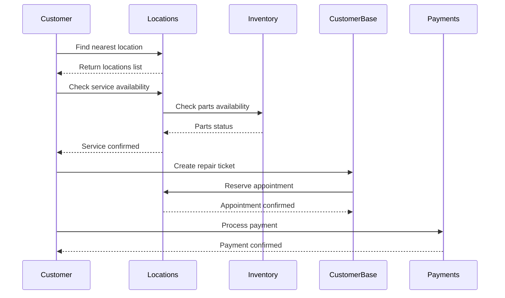
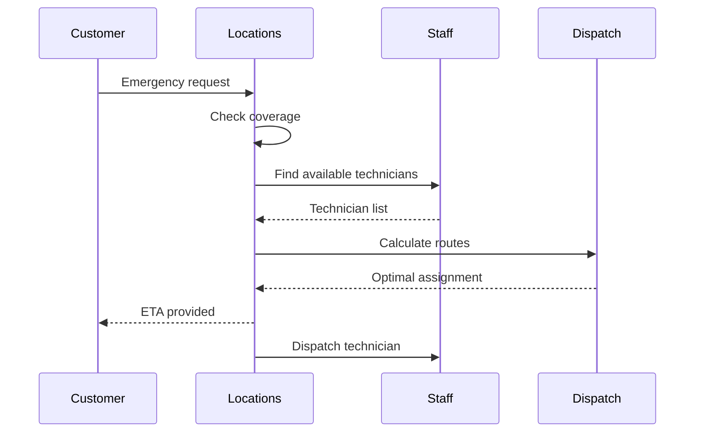

# Locations Service Use Cases

## Overview

The Locations Service is a critical component of MyComputer's infrastructure, enabling efficient management of repair center locations across Europe. This document outlines the primary use cases, user stories, and implementation scenarios.

## Primary Use Cases

### 1. Customer Location Discovery

#### Description
Customers need to find the nearest repair center to their current location or a specific address.

#### Actors
- End Customers
- Customer Service Representatives
- Mobile App Users

#### User Stories
- **As a customer**, I want to find the nearest repair center so that I can bring my computer for repair
- **As a mobile user**, I want to see repair centers on a map so that I can choose the most convenient location
- **As a customer service rep**, I want to help customers find locations with specific services available

#### Implementation Flow
```
1. Customer enters location (address/coordinates)
2. System geocodes address if needed
3. System queries nearby locations within radius
4. System filters by requested services
5. System returns sorted list by distance
6. Customer views results with distance and travel time
```

#### API Endpoints Used
- `GET /locations/nearby`
- `POST /locations/geocode`

### 2. Service Coverage Verification

#### Description
Verify if a customer's location is within the service coverage area for mobile repairs or pickup services.

#### Actors
- Customers
- Service Coordinators
- Field Technicians

#### User Stories
- **As a customer**, I want to know if mobile repair service is available at my location
- **As a service coordinator**, I want to verify coverage before scheduling a mobile repair
- **As a field technician**, I want to know my assigned coverage areas

#### Implementation Flow
```
1. Customer provides their address
2. System converts address to coordinates
3. System checks if coordinates fall within coverage polygons
4. System determines service availability and fees
5. System provides service options to customer
```

#### API Endpoints Used
- `POST /locations/coverage`
- `GET /locations/{id}/coverage-areas`

### 3. Multi-Location Inventory Search

#### Description
Search across multiple locations to find available inventory for customer repairs.

#### Actors
- Repair Technicians
- Inventory Managers
- Customer Service Representatives

#### User Stories
- **As a technician**, I want to find which locations have the parts I need
- **As an inventory manager**, I want to transfer stock between locations efficiently
- **As a customer service rep**, I want to tell customers where their repair can be completed fastest

#### Implementation Flow
```
1. Technician searches for required part
2. System queries inventory across all locations
3. System filters by availability and distance
4. System suggests optimal location or transfer
5. Technician reserves inventory at chosen location
```

#### Integration Points
- Inventory Service for stock levels
- Customer Base Service for customer location

### 4. Appointment Scheduling

#### Description
Schedule customer appointments based on location availability and operating hours.

#### Actors
- Customers
- Appointment Coordinators
- Store Managers

#### User Stories
- **As a customer**, I want to book an appointment at my preferred location and time
- **As a coordinator**, I want to see available slots across multiple locations
- **As a store manager**, I want to manage my location's appointment capacity

#### Implementation Flow
```
1. Customer selects preferred location
2. System retrieves location hours and capacity
3. System checks current appointment load
4. System presents available time slots
5. Customer books appointment
6. System updates location metrics
```

#### API Endpoints Used
- `GET /locations/{id}/hours`
- `GET /locations/{id}/metrics`
- `GET /locations/{id}/services`

### 5. Emergency Response Coordination

#### Description
Quickly identify and coordinate response from the nearest available technician for urgent repairs.

#### Actors
- Emergency Coordinators
- Field Technicians
- Premium Customers

#### User Stories
- **As an emergency coordinator**, I want to dispatch the nearest available technician
- **As a premium customer**, I want immediate response for critical system failures
- **As a field technician**, I want to know my emergency response area

#### Implementation Flow
```
1. Emergency request received with location
2. System identifies nearest locations with available staff
3. System checks technician availability and skills
4. System calculates response times
5. Coordinator dispatches optimal technician
6. System tracks response and updates metrics
```

#### API Endpoints Used
- `GET /locations/nearby`
- `GET /locations/{id}/staff`
- `POST /locations/coverage`

### 6. Regional Performance Analysis

#### Description
Analyze performance metrics across locations to identify trends and optimization opportunities.

#### Actors
- Regional Managers
- Business Analysts
- Executive Team

#### User Stories
- **As a regional manager**, I want to compare performance across my locations
- **As an analyst**, I want to identify underperforming locations
- **As an executive**, I want to see regional growth opportunities

#### Implementation Flow
```
1. Manager selects region and date range
2. System aggregates metrics for all locations
3. System calculates KPIs and comparisons
4. System generates visualizations and reports
5. Manager identifies action items
```

#### API Endpoints Used
- `GET /locations`
- `GET /locations/{id}/metrics`

### 7. New Location Planning

#### Description
Identify optimal locations for new repair centers based on coverage gaps and demand.

#### Actors
- Expansion Team
- Market Analysts
- Real Estate Team

#### User Stories
- **As an expansion planner**, I want to identify underserved areas
- **As a market analyst**, I want to evaluate location potential
- **As a real estate manager**, I want to find suitable properties

#### Implementation Flow
```
1. Analyst defines target region
2. System analyzes existing coverage
3. System identifies coverage gaps
4. System estimates demand based on population
5. System suggests optimal locations
6. Team evaluates recommendations
```

#### API Endpoints Used
- `GET /locations`
- `POST /locations/coverage`
- `POST /locations/geocode`

### 8. Mobile Workforce Management

#### Description
Manage and optimize mobile repair technicians' routes and territories.

#### Actors
- Fleet Managers
- Mobile Technicians
- Dispatch Coordinators

#### User Stories
- **As a fleet manager**, I want to optimize technician routes
- **As a mobile technician**, I want efficient routing to my appointments
- **As a dispatcher**, I want to assign jobs based on technician location

#### Implementation Flow
```
1. System receives daily appointment list
2. System groups appointments by area
3. System optimizes routes for each technician
4. System assigns territories dynamically
5. System tracks real-time technician locations
6. System adjusts routes based on traffic/delays
```

#### API Endpoints Used
- `GET /locations/nearby`
- `GET /locations/{id}/coverage-areas`

### 9. Seasonal Capacity Planning

#### Description
Adjust location capacity and hours based on seasonal demand patterns.

#### Actors
- Capacity Planners
- Store Managers
- HR Coordinators

#### User Stories
- **As a capacity planner**, I want to predict seasonal demand
- **As a store manager**, I want to adjust hours for peak seasons
- **As an HR coordinator**, I want to plan seasonal staffing

#### Implementation Flow
```
1. Planner reviews historical seasonal data
2. System analyzes patterns and trends
3. System predicts upcoming demand
4. Planner adjusts location capacity
5. System updates hours and staffing
6. System monitors actual vs. predicted
```

#### API Endpoints Used
- `GET /locations/{id}/metrics`
- `PUT /locations/{id}/hours`
- `PUT /locations/{id}`

### 10. Multi-Language Support

#### Description
Provide location information in multiple languages for international customers.

#### Actors
- International Customers
- Tourist Customers
- Multilingual Support Staff

#### User Stories
- **As an international customer**, I want location information in my language
- **As a tourist**, I want to find help in my native language
- **As support staff**, I want to assist customers in their preferred language

#### Implementation Flow
```
1. Customer selects preferred language
2. System retrieves location data
3. System fetches translations if available
4. System falls back to default language if needed
5. Customer receives localized information
```

#### Database Tables Used
- `location_translations`

## Integration Scenarios

### Scenario 1: Cross-Service Repair Workflow



### Scenario 2: Emergency Mobile Repair



## Performance Requirements

### Response Time SLAs
- Location search: < 200ms
- Coverage check: < 100ms
- Nearby search: < 300ms
- Bulk operations: < 5 seconds

### Availability Requirements
- 99.9% uptime for read operations
- 99.5% uptime for write operations
- Geographic redundancy across regions
- Automatic failover within 30 seconds

## Security Considerations

### Data Protection
- PII encryption for customer addresses
- GDPR compliance for location tracking
- Audit logging for all modifications
- Role-based access control

### API Security
- JWT authentication required
- Rate limiting per client
- IP whitelisting for admin operations
- SSL/TLS encryption for all traffic

## Monitoring and Analytics

### Key Metrics
- API response times
- Location search accuracy
- Coverage calculation performance
- Cache hit rates
- Database query performance

### Business Metrics
- Searches per location
- Conversion rate (search to appointment)
- Coverage area utilization
- Mobile service efficiency
- Customer satisfaction by location

## Future Enhancements

### Planned Features
1. **AI-Powered Demand Prediction**: Use machine learning to predict repair demand
2. **Real-Time Traffic Integration**: Incorporate traffic data for accurate ETAs
3. **Virtual Queue Management**: Allow customers to join virtual queues
4. **Augmented Reality Navigation**: AR guidance to repair centers
5. **Predictive Maintenance Alerts**: Notify customers of nearby services for preventive maintenance
6. **Dynamic Pricing**: Adjust service pricing based on demand and capacity
7. **Social Integration**: Share location and experiences on social media
8. **Voice-Activated Search**: Find locations using voice commands
9. **Blockchain Verification**: Immutable service history per location
10. **IoT Integration**: Connect with smart city infrastructure

## Conclusion

The Locations Service provides essential functionality for MyComputer's operations, enabling efficient customer service, optimized resource allocation, and data-driven decision making. These use cases demonstrate the service's versatility and critical role in the overall system architecture.
