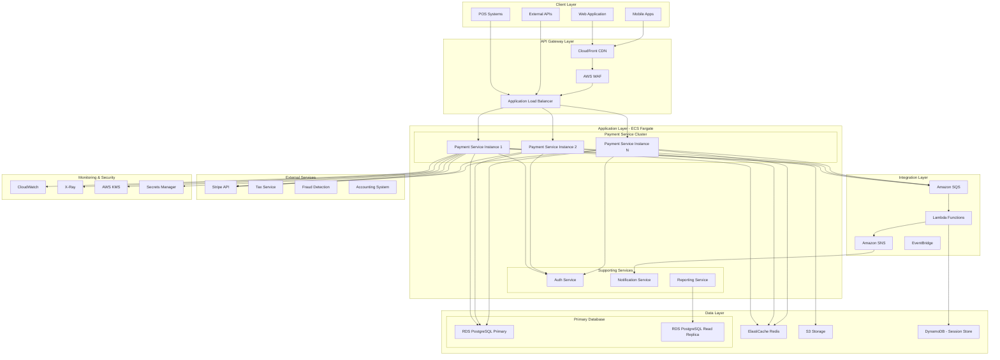

# Payments Service Architecture

## Overview

The Payments Processing Service is built on a microservices architecture deployed on AWS ECS, leveraging Stripe as the primary payment gateway. The system is designed for high availability, scalability, and security, supporting MyComputer's payment processing needs across Europe.

## Architecture Diagram



## System Components

### 1. Client Layer

#### Web Application
- **Technology**: Next.js 14 with React
- **Features**: Server-side rendering, progressive web app
- **Security**: Content Security Policy, HTTPS only
- **Performance**: Lazy loading, code splitting

#### Mobile Applications
- **Platforms**: iOS (Swift), Android (Kotlin)
- **Integration**: Native SDKs for Stripe
- **Offline Support**: Queue transactions for sync
- **Security**: Biometric authentication, certificate pinning

#### POS Systems
- **Hardware**: Compatible with standard terminals
- **Protocol**: REST API over HTTPS
- **Resilience**: Local queue for network failures
- **Updates**: Over-the-air firmware updates

### 2. API Gateway Layer

#### Application Load Balancer (ALB)
- **Configuration**: Multi-AZ deployment
- **Health Checks**: Deep health monitoring
- **SSL/TLS**: TLS 1.3 with perfect forward secrecy
- **Routing**: Path-based and host-based routing

#### AWS WAF
- **Protection**: SQL injection, XSS, DDoS
- **Rate Limiting**: 1000 requests per minute per IP
- **Geo-blocking**: Configurable by country
- **Custom Rules**: Business logic protection

#### CloudFront CDN
- **Distribution**: Global edge locations
- **Caching**: Static assets and API responses
- **Compression**: Gzip and Brotli
- **Security**: AWS Shield Standard

### 3. Application Layer

#### Payment Service (ECS Fargate)
```yaml
Service Configuration:
  Runtime: Node.js 18 LTS
  Framework: Express.js with TypeScript
  Container:
    CPU: 2 vCPU
    Memory: 4 GB
    Min Instances: 3
    Max Instances: 50
    Target CPU: 70%
  Health Check:
    Path: /health
    Interval: 30s
    Timeout: 5s
    Healthy Threshold: 2
    Unhealthy Threshold: 3
```

#### Core Modules
- **Payment Processing**: Stripe integration, retry logic
- **Invoice Management**: Generation, tracking, notifications
- **Subscription Engine**: Recurring billing, plan management
- **Refund Handler**: Automated and manual refunds
- **Webhook Processor**: Event handling, idempotency

#### Service Mesh
- **Service Discovery**: AWS Cloud Map
- **Load Balancing**: Application-level with circuit breakers
- **Communication**: gRPC for internal, REST for external
- **Tracing**: Distributed tracing with correlation IDs

### 4. Integration Layer

#### Amazon SQS
```yaml
Queue Configuration:
  Payment Queue:
    Type: FIFO
    Message Retention: 14 days
    Visibility Timeout: 300 seconds
    DLQ: After 3 retries
    
  Notification Queue:
    Type: Standard
    Message Retention: 4 days
    Visibility Timeout: 60 seconds
```

#### EventBridge
- **Event Bus**: Custom event bus for payment events
- **Rules**: 25+ rules for event routing
- **Targets**: Lambda, SQS, SNS, Step Functions
- **Archive**: 90-day event replay capability

#### Lambda Functions
- **Payment Webhook Handler**: Process Stripe webhooks
- **Currency Converter**: Real-time exchange rates
- **Tax Calculator**: EU VAT calculation
- **Report Generator**: Async report generation
- **Data Transformer**: ETL for analytics

### 5. Data Layer

#### PostgreSQL (RDS)
```yaml
Database Configuration:
  Engine: PostgreSQL 15
  Instance Class: db.r6g.2xlarge
  Storage: 1TB SSD with autoscaling
  Multi-AZ: Yes
  Read Replicas: 2
  Backup:
    Automated: Daily with 35-day retention
    Snapshots: Weekly manual snapshots
  Encryption: AES-256 at rest
```

#### Database Schema Strategy
- **Partitioning**: Monthly partitions for transactions
- **Indexing**: Covering indexes for common queries
- **Archival**: Automated archival after 2 years
- **Optimization**: Query performance insights enabled

#### Redis Cache (ElastiCache)
```yaml
Cache Configuration:
  Engine: Redis 7.0
  Node Type: cache.r6g.xlarge
  Cluster Mode: Enabled
  Shards: 3
  Replicas per Shard: 2
  Eviction Policy: allkeys-lru
  Use Cases:
    - Session storage
    - Payment intent caching
    - Rate limiting counters
    - Idempotency keys
```

#### S3 Storage
- **Buckets**:
  - `payments-invoices`: PDF invoice storage
  - `payments-reports`: Generated reports
  - `payments-logs`: Audit logs
  - `payments-backups`: Database backups
- **Lifecycle**: Intelligent tiering, glacier after 90 days
- **Encryption**: SSE-S3 with customer keys
- **Versioning**: Enabled for critical documents

### 6. External Integrations

#### Stripe Integration
```javascript
// Stripe Configuration
const stripe = new Stripe(process.env.STRIPE_SECRET_KEY, {
  apiVersion: '2023-10-16',
  maxNetworkRetries: 3,
  timeout: 30000,
  telemetry: false,
  typescript: true
});

// Webhook Configuration
const webhookEndpoint = {
  url: 'https://api.mycomputer.eu/payments/webhooks/stripe',
  enabledEvents: [
    'payment_intent.succeeded',
    'payment_intent.payment_failed',
    'charge.refunded',
    'customer.subscription.created',
    'customer.subscription.updated',
    'customer.subscription.deleted'
  ]
};
```

#### Integration Patterns
- **Circuit Breaker**: Hystrix pattern for external calls
- **Retry Logic**: Exponential backoff with jitter
- **Timeout Handling**: 30-second timeout with fallback
- **Rate Limiting**: Respect external API limits
- **Error Handling**: Graceful degradation

### 7. Security Architecture

#### Encryption
- **In Transit**: TLS 1.3 for all communications
- **At Rest**: AES-256 for database and storage
- **Key Management**: AWS KMS with annual rotation
- **Secrets**: AWS Secrets Manager for API keys

#### Authentication & Authorization
```yaml
Security Configuration:
  Authentication:
    Type: JWT with refresh tokens
    Issuer: Auth Service
    Expiry: 15 minutes (access), 7 days (refresh)
    
  Authorization:
    Model: RBAC with permissions
    Roles:
      - payment_admin: Full access
      - payment_operator: Process payments
      - payment_viewer: Read-only access
      - payment_support: Refunds and queries
```

#### Compliance
- **PCI DSS**: Level 1 compliance
- **GDPR**: Data privacy and protection
- **SOC 2**: Type II certification
- **ISO 27001**: Information security

### 8. Monitoring & Observability

#### CloudWatch Metrics
```yaml
Custom Metrics:
  Business Metrics:
    - payment.success.rate
    - payment.processing.time
    - payment.amount.total
    - refund.rate
    
  Technical Metrics:
    - api.latency.p99
    - database.connections.active
    - cache.hit.rate
    - queue.depth
    
  Alarms:
    - Payment success rate < 95%
    - API latency p99 > 1000ms
    - Database CPU > 80%
    - Queue depth > 1000
```

#### Distributed Tracing
- **X-Ray**: End-to-end request tracing
- **Correlation IDs**: Track requests across services
- **Performance Analysis**: Identify bottlenecks
- **Service Map**: Visualize dependencies

#### Logging
```yaml
Logging Configuration:
  Application Logs:
    Level: INFO (production), DEBUG (staging)
    Format: JSON structured logging
    Destination: CloudWatch Logs
    Retention: 30 days
    
  Audit Logs:
    Events: All payment operations
    Format: Immutable JSON
    Destination: S3 with object lock
    Retention: 7 years
```

## Deployment Architecture

### CI/CD Pipeline
```yaml
Pipeline Stages:
  1. Source:
     - GitHub repository
     - Branch protection rules
     - Automated security scanning
     
  2. Build:
     - Docker image creation
     - Unit tests execution
     - Code coverage > 80%
     
  3. Test:
     - Integration tests
     - Load testing
     - Security scanning
     
  4. Deploy to Staging:
     - Blue-green deployment
     - Smoke tests
     - Performance validation
     
  5. Deploy to Production:
     - Canary deployment (10% -> 50% -> 100%)
     - Health monitoring
     - Automatic rollback on errors
```

### Infrastructure as Code
```terraform
# Terraform Configuration Example
module "payment_service" {
  source = "./modules/ecs-service"
  
  name                = "payment-service"
  cluster_id          = aws_ecs_cluster.main.id
  task_definition_arn = aws_ecs_task_definition.payment.arn
  
  desired_count    = 3
  min_capacity     = 3
  max_capacity     = 50
  
  target_group_arn = aws_lb_target_group.payment.arn
  
  autoscaling_target_cpu    = 70
  autoscaling_target_memory = 80
  
  environment = "production"
  region      = "eu-west-1"
}
```

## Disaster Recovery

### Backup Strategy
- **RTO**: 15 minutes
- **RPO**: 5 minutes
- **Backup Frequency**: Continuous replication
- **Backup Locations**: Multi-region (eu-west-1, eu-central-1)

### Failover Process
1. **Detection**: Automated health checks
2. **Decision**: Automatic for AZ, manual for region
3. **Failover**: DNS update, connection draining
4. **Validation**: Smoke tests, monitoring
5. **Communication**: Automated stakeholder alerts

## Performance Optimization

### Caching Strategy
- **L1 Cache**: Application-level (in-memory)
- **L2 Cache**: Redis for shared data
- **L3 Cache**: CloudFront for static content
- **Cache Invalidation**: Event-driven and TTL-based

### Database Optimization
- **Connection Pooling**: PgBouncer with 100 connections
- **Query Optimization**: Prepared statements, explain plans
- **Read Scaling**: Read replicas for reports
- **Write Scaling**: Sharding by customer_id

### API Optimization
- **Response Compression**: Gzip for > 1KB
- **Pagination**: Cursor-based for large datasets
- **Field Selection**: GraphQL-like sparse fieldsets
- **Batch Operations**: Bulk endpoints for efficiency

## Scalability Considerations

### Horizontal Scaling
- **Auto-scaling**: CPU and memory-based
- **Load Distribution**: Even distribution across AZs
- **Service Mesh**: Dynamic service discovery
- **Database Sharding**: Ready for implementation

### Vertical Scaling
- **Instance Types**: Optimized for compute
- **Memory Management**: Efficient garbage collection
- **Connection Limits**: Configurable per instance
- **Resource Monitoring**: Proactive capacity planning

## Future Architecture Enhancements

### Planned Improvements
1. **Event Sourcing**: Complete audit trail
2. **CQRS Pattern**: Separate read/write models
3. **GraphQL Gateway**: Flexible API queries
4. **Service Mesh**: Istio for advanced traffic management
5. **Multi-Region**: Active-active deployment
6. **Blockchain Integration**: Immutable transaction log
7. **AI/ML Pipeline**: Fraud detection and optimization

## Related Documentation

- [API Documentation](../reference/api.md) - API specifications
- [Data Model](../reference/data-model.md) - Database schema
- [Use Cases](use-cases.md) - Business scenarios
- [Business Value](business-value.md) - ROI and benefits
