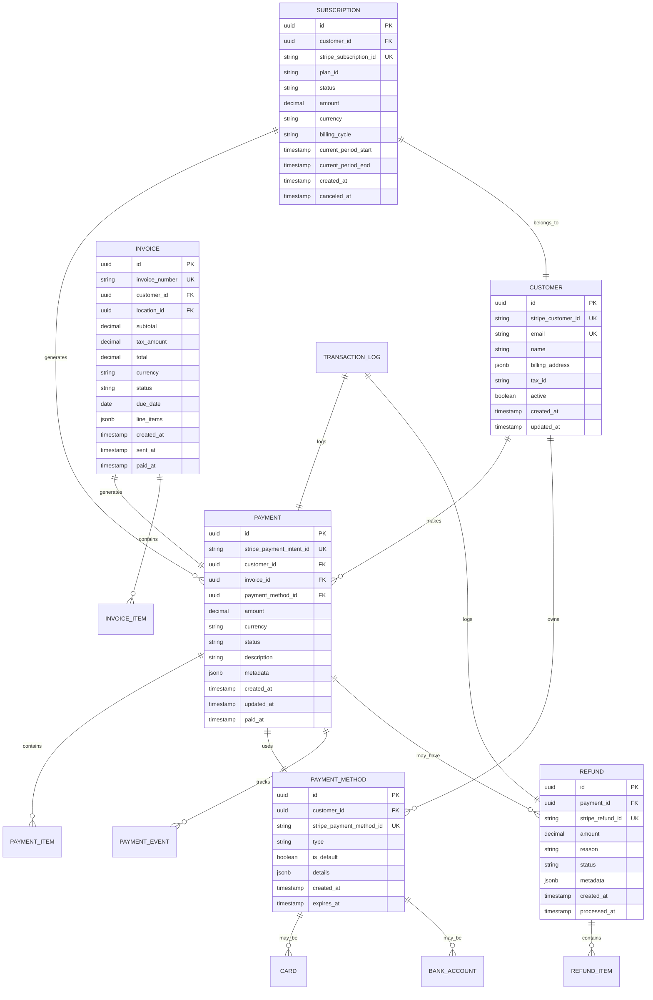

# Payments Service Data Model

## Overview

The Payments Service data model is designed to handle complex financial transactions while maintaining data integrity, audit trails, and compliance with financial regulations. The model supports multi-currency transactions, various payment methods, and comprehensive financial reporting.

## Entity Relationship Diagram



## Core Entities

### Payment

The central entity representing a payment transaction.

| Column | Type | Constraints | Description |
|--------|------|-------------|-------------|
| id | UUID | PRIMARY KEY | Unique identifier |
| stripe_payment_intent_id | VARCHAR(255) | UNIQUE, NOT NULL | Stripe payment intent reference |
| customer_id | UUID | FOREIGN KEY | Reference to customer |
| invoice_id | UUID | FOREIGN KEY | Reference to associated invoice |
| payment_method_id | UUID | FOREIGN KEY | Reference to payment method used |
| amount | DECIMAL(10,2) | NOT NULL | Payment amount |
| currency | VARCHAR(3) | NOT NULL | ISO 4217 currency code |
| status | VARCHAR(50) | NOT NULL | Payment status (pending, processing, succeeded, failed, canceled) |
| description | TEXT | | Payment description |
| metadata | JSONB | | Additional payment metadata |
| created_at | TIMESTAMP | NOT NULL | Creation timestamp |
| updated_at | TIMESTAMP | NOT NULL | Last update timestamp |
| paid_at | TIMESTAMP | | Payment completion timestamp |

**Indexes:**
- `idx_payment_customer_id` on (customer_id)
- `idx_payment_status` on (status)
- `idx_payment_created_at` on (created_at)
- `idx_payment_stripe_id` on (stripe_payment_intent_id)

### Customer

Represents a customer in the payment system.

| Column | Type | Constraints | Description |
|--------|------|-------------|-------------|
| id | UUID | PRIMARY KEY | Unique identifier |
| stripe_customer_id | VARCHAR(255) | UNIQUE, NOT NULL | Stripe customer reference |
| email | VARCHAR(255) | UNIQUE, NOT NULL | Customer email |
| name | VARCHAR(255) | NOT NULL | Customer full name |
| billing_address | JSONB | | Billing address details |
| tax_id | VARCHAR(50) | | VAT/Tax identification number |
| active | BOOLEAN | DEFAULT true | Customer account status |
| created_at | TIMESTAMP | NOT NULL | Creation timestamp |
| updated_at | TIMESTAMP | NOT NULL | Last update timestamp |

**Indexes:**
- `idx_customer_email` on (email)
- `idx_customer_stripe_id` on (stripe_customer_id)
- `idx_customer_active` on (active)

### Payment Method

Stores customer payment methods.

| Column | Type | Constraints | Description |
|--------|------|-------------|-------------|
| id | UUID | PRIMARY KEY | Unique identifier |
| customer_id | UUID | FOREIGN KEY | Reference to customer |
| stripe_payment_method_id | VARCHAR(255) | UNIQUE, NOT NULL | Stripe payment method reference |
| type | VARCHAR(50) | NOT NULL | Payment method type (card, bank_account, sepa_debit) |
| is_default | BOOLEAN | DEFAULT false | Default payment method flag |
| details | JSONB | | Payment method details (last4, brand, etc.) |
| created_at | TIMESTAMP | NOT NULL | Creation timestamp |
| expires_at | TIMESTAMP | | Expiration date (for cards) |

**Indexes:**
- `idx_payment_method_customer` on (customer_id)
- `idx_payment_method_type` on (type)
- `idx_payment_method_default` on (customer_id, is_default)

### Invoice

Represents an invoice for services.

| Column | Type | Constraints | Description |
|--------|------|-------------|-------------|
| id | UUID | PRIMARY KEY | Unique identifier |
| invoice_number | VARCHAR(50) | UNIQUE, NOT NULL | Sequential invoice number |
| customer_id | UUID | FOREIGN KEY | Reference to customer |
| location_id | UUID | FOREIGN KEY | Reference to service location |
| subtotal | DECIMAL(10,2) | NOT NULL | Subtotal before tax |
| tax_amount | DECIMAL(10,2) | NOT NULL | Tax amount |
| total | DECIMAL(10,2) | NOT NULL | Total amount |
| currency | VARCHAR(3) | NOT NULL | ISO 4217 currency code |
| status | VARCHAR(50) | NOT NULL | Invoice status (draft, sent, paid, overdue, canceled) |
| due_date | DATE | NOT NULL | Payment due date |
| line_items | JSONB | NOT NULL | Invoice line items |
| created_at | TIMESTAMP | NOT NULL | Creation timestamp |
| sent_at | TIMESTAMP | | Invoice sent timestamp |
| paid_at | TIMESTAMP | | Payment received timestamp |

**Indexes:**
- `idx_invoice_customer` on (customer_id)
- `idx_invoice_status` on (status)
- `idx_invoice_due_date` on (due_date)
- `idx_invoice_number` on (invoice_number)

### Refund

Tracks refund transactions.

| Column | Type | Constraints | Description |
|--------|------|-------------|-------------|
| id | UUID | PRIMARY KEY | Unique identifier |
| payment_id | UUID | FOREIGN KEY | Reference to original payment |
| stripe_refund_id | VARCHAR(255) | UNIQUE, NOT NULL | Stripe refund reference |
| amount | DECIMAL(10,2) | NOT NULL | Refund amount |
| reason | VARCHAR(255) | | Refund reason |
| status | VARCHAR(50) | NOT NULL | Refund status (pending, succeeded, failed, canceled) |
| metadata | JSONB | | Additional refund metadata |
| created_at | TIMESTAMP | NOT NULL | Creation timestamp |
| processed_at | TIMESTAMP | | Processing completion timestamp |

**Indexes:**
- `idx_refund_payment` on (payment_id)
- `idx_refund_status` on (status)
- `idx_refund_created_at` on (created_at)

### Subscription

Manages recurring payment subscriptions.

| Column | Type | Constraints | Description |
|--------|------|-------------|-------------|
| id | UUID | PRIMARY KEY | Unique identifier |
| customer_id | UUID | FOREIGN KEY | Reference to customer |
| stripe_subscription_id | VARCHAR(255) | UNIQUE, NOT NULL | Stripe subscription reference |
| plan_id | VARCHAR(100) | NOT NULL | Subscription plan identifier |
| status | VARCHAR(50) | NOT NULL | Subscription status (active, past_due, canceled, unpaid) |
| amount | DECIMAL(10,2) | NOT NULL | Recurring amount |
| currency | VARCHAR(3) | NOT NULL | ISO 4217 currency code |
| billing_cycle | VARCHAR(20) | NOT NULL | Billing frequency (monthly, quarterly, yearly) |
| current_period_start | TIMESTAMP | NOT NULL | Current billing period start |
| current_period_end | TIMESTAMP | NOT NULL | Current billing period end |
| created_at | TIMESTAMP | NOT NULL | Creation timestamp |
| canceled_at | TIMESTAMP | | Cancellation timestamp |

**Indexes:**
- `idx_subscription_customer` on (customer_id)
- `idx_subscription_status` on (status)
- `idx_subscription_plan` on (plan_id)

### Payment Event

Audit log for payment lifecycle events.

| Column | Type | Constraints | Description |
|--------|------|-------------|-------------|
| id | UUID | PRIMARY KEY | Unique identifier |
| payment_id | UUID | FOREIGN KEY | Reference to payment |
| event_type | VARCHAR(50) | NOT NULL | Event type (created, processing, succeeded, failed) |
| event_data | JSONB | | Event details |
| stripe_event_id | VARCHAR(255) | | Stripe webhook event ID |
| created_at | TIMESTAMP | NOT NULL | Event timestamp |

**Indexes:**
- `idx_payment_event_payment` on (payment_id)
- `idx_payment_event_type` on (event_type)
- `idx_payment_event_created` on (created_at)

### Transaction Log

Comprehensive audit trail for all financial transactions.

| Column | Type | Constraints | Description |
|--------|------|-------------|-------------|
| id | UUID | PRIMARY KEY | Unique identifier |
| entity_type | VARCHAR(50) | NOT NULL | Entity type (payment, refund, subscription) |
| entity_id | UUID | NOT NULL | Reference to entity |
| action | VARCHAR(50) | NOT NULL | Action performed |
| user_id | UUID | | User who performed action |
| ip_address | INET | | Client IP address |
| user_agent | TEXT | | Client user agent |
| request_data | JSONB | | Request payload |
| response_data | JSONB | | Response payload |
| created_at | TIMESTAMP | NOT NULL | Log timestamp |

**Indexes:**
- `idx_transaction_log_entity` on (entity_type, entity_id)
- `idx_transaction_log_created` on (created_at)
- `idx_transaction_log_user` on (user_id)

## Data Integrity Rules

### Constraints

1. **Payment Amount**: Must be greater than 0
2. **Currency Codes**: Must be valid ISO 4217 codes
3. **Email Format**: Must be valid email format
4. **Status Values**: Must be from predefined enums
5. **Timestamps**: created_at <= updated_at
6. **Refund Amount**: Cannot exceed original payment amount

### Triggers

1. **Update Timestamp**: Automatically update `updated_at` on record modification
2. **Invoice Number Generation**: Auto-generate sequential invoice numbers
3. **Default Payment Method**: Ensure only one default per customer
4. **Subscription Status**: Update payment status when subscription changes
5. **Audit Logging**: Create transaction log entries for all changes

## Performance Considerations

### Partitioning Strategy

- **Payments Table**: Partitioned by `created_at` (monthly)
- **Transaction Logs**: Partitioned by `created_at` (monthly)
- **Payment Events**: Partitioned by `created_at` (weekly)

### Archival Strategy

- Move completed payments older than 2 years to archive tables
- Compress transaction logs older than 1 year
- Retain summary data indefinitely for reporting

## Security Considerations

### Encryption

- All sensitive fields encrypted at rest using AWS KMS
- Card details never stored, only tokenized references
- PII fields encrypted with customer-specific keys

### Access Control

- Row-level security for multi-tenant isolation
- Column-level encryption for sensitive data
- Audit logging for all data access

## Migration Scripts

```sql
-- Example migration for creating payments table
CREATE TABLE payments (
    id UUID PRIMARY KEY DEFAULT gen_random_uuid(),
    stripe_payment_intent_id VARCHAR(255) UNIQUE NOT NULL,
    customer_id UUID NOT NULL REFERENCES customers(id),
    invoice_id UUID REFERENCES invoices(id),
    payment_method_id UUID REFERENCES payment_methods(id),
    amount DECIMAL(10,2) NOT NULL CHECK (amount > 0),
    currency VARCHAR(3) NOT NULL,
    status VARCHAR(50) NOT NULL,
    description TEXT,
    metadata JSONB DEFAULT '{}',
    created_at TIMESTAMP NOT NULL DEFAULT CURRENT_TIMESTAMP,
    updated_at TIMESTAMP NOT NULL DEFAULT CURRENT_TIMESTAMP,
    paid_at TIMESTAMP
);

-- Create indexes
CREATE INDEX idx_payment_customer_id ON payments(customer_id);
CREATE INDEX idx_payment_status ON payments(status);
CREATE INDEX idx_payment_created_at ON payments(created_at);

-- Create update trigger
CREATE TRIGGER update_payments_updated_at
    BEFORE UPDATE ON payments
    FOR EACH ROW
    EXECUTE FUNCTION update_updated_at_column();
```

## Related Documentation

- [API Documentation](api.md) - REST API endpoints for data operations
- [Architecture Overview](../explanation/architecture.md) - System architecture and data flow
- [Security & Compliance](../explanation/security-compliance.md) - Security measures and compliance requirements
